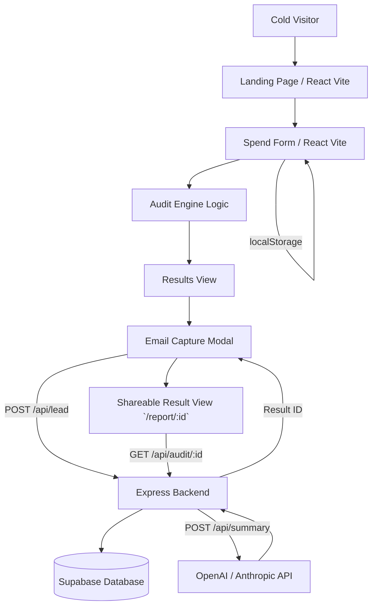

# Architecture

## Data Flow
1. User lands on the Vite app.
2. Form data (tools, spend, users, etc.) is held in React state and persisted to `localStorage`.
3. The Audit Engine evaluates the state instantly to calculate savings (runs entirely on the client for zero-latency feedback).
4. Results are displayed.
5. User provides email for the full report. A POST request is sent to the Express backend with the email and audit data.
6. Express backend calls the LLM API to get a custom summary, saves the audit + summary + email to Supabase, and returns a unique report ID.
7. User is redirected to `/report/:id`.

## Why this stack?
React + Vite + Tailwind was chosen because it allows for lightning-fast iterative UI development and results in a highly optimized SPA bundle. Express was chosen for the backend to securely manage API keys (LLM) and interface with the database without adding the mental overhead of full Next.js server actions if the goal was sheer velocity in 1 day.

## Handling 10k audits/day
To handle 10k audits/day, the current stack is already quite capable, but I would change:
- **Caching**: Implement a Redis cache for the generated LLM summaries, as many inputs (e.g. "ChatGPT Team 2 users") might result in identical or highly similar summaries, saving API costs.
- **Queueing**: Use BullMQ/RabbitMQ for processing the emails via Resend so that the user isn't blocked on the request if the email API is slow.
- **Edge Deployment**: Move the backend to Cloudflare Workers or Vercel Edge Functions to ensure lowest latency globally.
